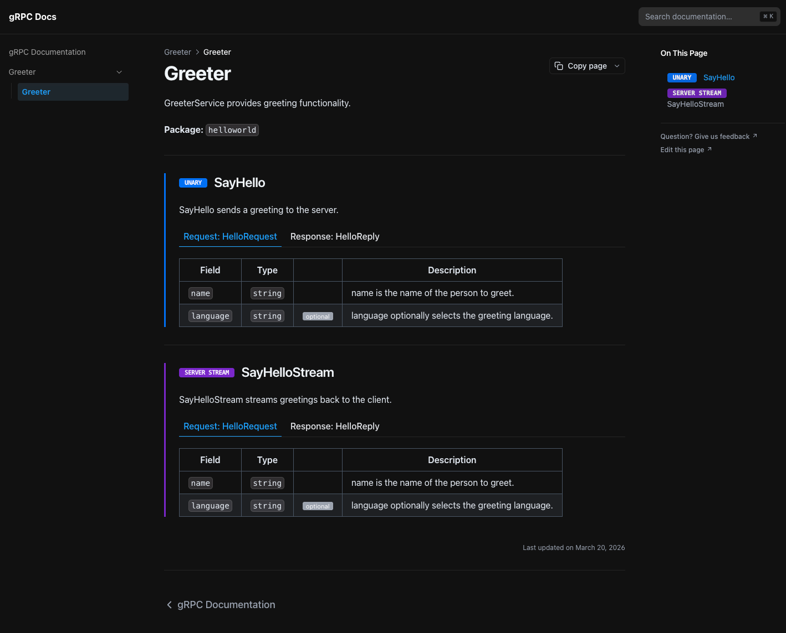

# protoc-gen-nextra

A `protoc` plugin that generates [Nextra](https://nextra.site) MDX documentation pages from gRPC service definitions.



Each `.proto` file with services produces a `.mdx` page with:

- **RPC type badges** — `UNARY`, `SERVER STREAM`, `CLIENT STREAM`, `BIDI STREAM` — color-coded and visually distinct
- **Tabbed request/response** — fields shown in switchable tabs, not stacked
- **Field tables** with type, `optional`/`repeated` pills, and inline doc comments
- Source comments from your `.proto` file carried through as descriptions

## Requirements

- Go 1.21+
- `protoc` — e.g. `brew install protobuf`

## Installation

```sh
go install github.com/jamillosantos/protoc-gen-nextra/cmd/protoc-gen-nextra@latest
```

## Usage

### With Buf (recommended)

Install the binary, then add the plugin to your `buf.gen.yaml`:

```yaml
version: v2
plugins:
  - local: protoc-gen-nextra
    out: docs/content
```

Then run:

```sh
buf generate
```

### With protoc

```sh
protoc \
  --nextra_out=./docs/content \
  -I ./proto \
  ./proto/**/*.proto
```

`--nextra_out` should point to the `content/` directory of your Nextra project. The plugin mirrors the proto package path as subdirectories, placing one `.mdx` file per service.

### Example

Given this proto:

```proto
syntax = "proto3";
package helloworld;

// Greeter provides greeting functionality.
service Greeter {
  // SayHello sends a greeting.
  rpc SayHello (HelloRequest) returns (HelloReply);

  // SayHelloStream streams greetings back to the client.
  rpc SayHelloStream (HelloRequest) returns (stream HelloReply);
}
```

The plugin generates `helloworld/greeter.mdx` with:

- A `UNARY` badge for `SayHello`
- A `SERVER STREAM` badge for `SayHelloStream`
- Tabbed request/response field tables for each method

## Nextra setup

The generated MDX uses `<Tabs>` from `nextra/components`. Your Nextra project needs nextra v4+:

```sh
bun add nextra nextra-theme-docs next react react-dom
```

Your `next.config.mjs`:

```js
import nextra from 'nextra'

const withNextra = nextra({ contentDirBasePath: '/' })
export default withNextra()
```

See [`testdata/`](./testdata) for a working example — run `bun run dev` inside it to preview the output locally.

## Badge colours

| Streaming type | Badge |
|---|---|
| Unary |  |
| Server streaming |  |
| Client streaming |  |
| Bidirectional |  |

## Development

```sh
# Build the binary
make build

# Generate MDX from the test proto and run tests
make test

# Preview in Nextra
cd testdata && bun run dev

# Regenerate golden test files after template changes
make update-golden
```

## License

MIT
